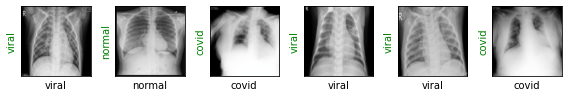

# Detecting-COVID-19-with-Chest-X-Ray-using-PyTorch
Create an image classification model that can predict Chest X-Ray scans that belong to one of the three classes with a reasonably high accuracy by finetuning a ResNet-18 model on a COVID-19 Radiography dataset.

Download the dataset from kaggle [COVID-19 Radiography Database](https://www.kaggle.com/datasets/tawsifurrahman/covid19-radiography-database) (The paths of images may change due to dataset update).

# Packages
* Python >= 3.6
* Pytorch >= 1.10.0

# Predictions 

